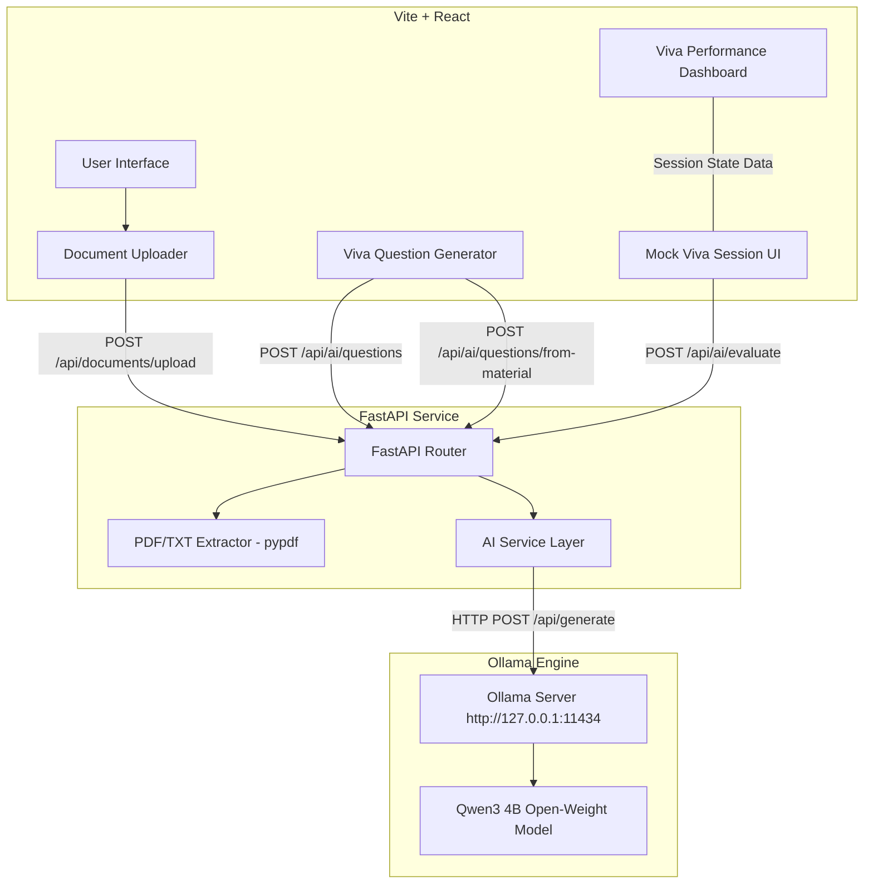

# VivaMate — AI-Powered Personalized Viva Practice

> **Master your oral vivas with privacy-first local open-weight AI.**  
> Built for the *"Build for a Friend"* Hacktoberfest 2026 Challenge.

---

## 1. Overview
**VivaMate** is an interactive, student-focused mock viva practice platform. It helps engineering and computer science students prepare for technical oral examinations by generating structured viva questions, conducting one-question-at-a-time mock exams, providing real-time AI answer evaluations, and delivering a comprehensive performance dashboard.

---

## 2. Problem
Oral viva examinations test conceptual depth, real-time articulation, and technical clarity under pressure. However, students face major preparation hurdles:
- **Lack of Practice Partners**: Studying alone makes it hard to simulate interactive viva questioning.
- **Generic Flashcards**: Traditional static quizzes don't evaluate open-ended explanations or offer constructive feedback.
- **Privacy & Cost Concerns**: Online cloud AI tools risk leaking proprietary course notes and incur recurring subscription or API token costs.

---

## 3. Solution
VivaMate solves these challenges by combining a modern, reactive web UI with a lightweight local backend powered by an open-weight AI model (**Qwen3 4B via Ollama**). Students can upload their course materials (PDF or TXT) or specify custom topics to generate targeted, university-level viva questions, receive instant scoring with detailed feedback, and review performance without sending any data to third-party cloud APIs.

---

## 4. Key Features
- 📄 **PDF / TXT Study Material Upload**: Ingest course documents and extract text directly in memory.
- 🎯 **Targeted Question Generation**: Generate viva questions from uploaded study materials or manually specified subjects with customizable difficulty (*Easy*, *Medium*, *Hard*, *Mixed*) and count (1–10).
- 🎙️ **Interactive Mock Viva Engine**: Clean, focused interface displaying one question at a time with progress tracking and answer submission.
- 🤖 **AI Answer Evaluation**: Analyzes open-ended student answers to produce:
  - Numerical score ($0–10$)
  - Correctness classification (*Incorrect*, *Partially Correct*, *Mostly Correct*, *Correct*)
  - Detailed feedback highlighting missing concepts
  - Ideal reference answer
  - Follow-up question
- 📊 **Final Viva Performance Dashboard**:
  - Overall score percentage and circular progress visualization
  - Automated strengths identification (high-scoring questions)
  - Actionable areas to improve (lower-scoring feedback)
  - Accordion-based question review
  - Session actions (*Practice Again*, *Generate New Viva*)

---

## 5. How It Works
1. **Upload & Ingest**: Upload course notes or choose a computer science topic.
2. **Generate**: Qwen3 4B creates structured viva questions formatted specifically for university engineering students.
3. **Practice**: Answer questions sequentially in the interactive mock viva view.
4. **Evaluate & Review**: Receive immediate AI evaluation for each response, followed by an end-of-session performance report.

---

## 6. Architecture



---

## 7. Open-Source AI / Privacy
VivaMate is designed around a **privacy-first, open-weight AI architecture**:

$$\text{React Frontend} \longrightarrow \text{FastAPI Backend} \longrightarrow \text{Ollama} \longrightarrow \text{Qwen3 4B}$$

- **100% Local Inference**: All AI generation and evaluation runs locally on your machine via Ollama.
- **Privacy-Oriented**: Course materials, uploaded notes, and student answers remain strictly on local memory and are never transmitted to external cloud APIs.
- **No Token/API Fees**: Operating costs are zero—no API keys or subscriptions required.
- **Swappable Models**: The modular `OllamaService` abstraction allows replacing `qwen3:4b` with any other compatible local model (e.g., `llama3`, `mistral`, `gemma`) via environment configuration.

---

## 8. Tech Stack
- **Frontend**: React 19, Vite, Vanilla CSS (Design Tokens & Glassmorphism), Lucide React
- **Backend**: Python 3.10+, FastAPI, Pydantic v2, HTTPX, PyPDF, Python-Multipart, Uvicorn
- **AI Engine**: Ollama, Qwen3 4B (`qwen3:4b`)

---

## 9. Project Structure
```text
Hacktober_Challenge/
├── backend/
│   ├── app/
│   │   ├── api/
│   │   │   ├── ai.py             # AI generation & evaluation endpoints
│   │   │   ├── documents.py      # PDF/TXT extraction endpoints
│   │   │   └── health.py         # Health check endpoint
│   │   ├── core/
│   │   │   └── config.py         # App & Ollama settings
│   │   ├── schemas/
│   │   │   ├── ai.py             # Pydantic request/response schemas
│   │   │   └── document.py       # Document upload schemas
│   │   ├── services/
│   │   │   ├── ai/               # Ollama AI service layer
│   │   │   └── document.py       # PyPDF text extractor
│   │   └── main.py               # FastAPI application entry point
│   ├── requirements.txt          # Python dependencies
│   └── venv/                     # Python virtual environment
├── frontend/
│   ├── src/
│   │   ├── components/
│   │   │   ├── DocumentUploader.jsx      # PDF/TXT file upload component
│   │   │   ├── MockVivaSession.jsx       # Interactive viva session runner
│   │   │   ├── VivaPerformanceReport.jsx # Final performance dashboard
│   │   │   └── VivaQuestionGenerator.jsx # Setup & question card UI
│   │   ├── App.jsx                       # Main layout & health indicator
│   │   ├── main.jsx                      # Vite entry point
│   │   └── index.css                     # Design system & styles
│   ├── package.json                      # Frontend dependencies
│   └── vite.config.js                    # Vite server configuration
├── .gitignore
└── README.md
```

---

## 10. Requirements
- **Node.js**: `v18.0.0` or higher
- **Python**: `3.10` or higher
- **Ollama**: Installed and running locally
- **Ollama Model**: `qwen3:4b`

---

## 11. Local Setup

### Step 1: Install & Launch Ollama
1. Download and install [Ollama](https://ollama.ai/).
2. Pull and verify the Qwen3 4B model in your terminal:
   ```bash
   ollama pull qwen3:4b
   ```
3. Ensure Ollama is running at `http://127.0.0.1:11434`.

### Step 2: Backend Setup (FastAPI)
1. Open terminal and navigate to the project directory:
   ```bash
   cd Hacktober_Challenge
   ```
2. Create and activate a Python virtual environment:
   - **Windows (PowerShell / Git Bash)**:
     ```bash
     python -m venv backend/venv
     source backend/venv/Scripts/activate
     ```
   - **Linux / macOS**:
     ```bash
     python3 -m venv backend/venv
     source backend/venv/bin/activate
     ```
3. Install dependencies:
   ```bash
   pip install -r backend/requirements.txt
   ```
4. Start the FastAPI server:
   ```bash
   uvicorn backend.app.main:app --reload --host 127.0.0.1 --port 8000
   ```
   *The API will be available at `http://127.0.0.1:8000`.*

### Step 3: Frontend Setup (React / Vite)
1. Open a new terminal window and navigate to the frontend directory:
   ```bash
   cd Hacktober_Challenge/frontend
   ```
2. Install dependencies:
   ```bash
   npm install
   ```
3. Start the Vite development server:
   ```bash
   npm run dev
   ```
4. Open your browser and navigate to `http://localhost:5173`.

---

## 12. API Overview

| Endpoint | Method | Description |
| :--- | :---: | :--- |
| `/api/health` | `GET` | Returns backend connection status and service health. |
| `/api/ai/test` | `POST` | Validates connectivity between FastAPI and the local Ollama instance. |
| `/api/ai/questions` | `POST` | Generates topic-based viva questions with specified count and difficulty. |
| `/api/ai/questions/from-material` | `POST` | Generates viva questions directly derived from uploaded study material text. |
| `/api/ai/evaluate` | `POST` | Evaluates a student's answer, returning score, correctness, feedback, ideal answer, and follow-up. |
| `/api/documents/upload` | `POST` | Accepts a PDF or TXT file upload and extracts plain text content in memory. |

---

## 13. Example Workflow
1. Start local Ollama, FastAPI, and Vite dev server.
2. In the browser (`http://localhost:5173`), confirm **Backend Connected** status.
3. Upload a lecture PDF (e.g., `Computer_Networks_Ch3.pdf`).
4. Select **5 Questions** and **Mixed** difficulty, then click **Generate Viva Questions**.
5. Click **Start Viva Session**.
6. Answer each question in the text area and click **Submit Answer**.
7. Review immediate AI feedback, score, and ideal answer, then click **Next Question**.
8. View the **Final Viva Performance Dashboard** summarizing your total score, percentage, strengths, weaknesses, and detailed review.

---

## 14. MVP Limitations
- **File Formats**: Supports PDF (`.pdf`) and Plain Text (`.txt`) files only.
- **In-Memory Processing**: Uploaded study materials are held in transient memory per request; no permanent server storage or database is attached.
- **Context Limits**: Large PDF files are truncated to an initial character limit suitable for local LLM prompt windows.
- **Stateless Sessions**: Session history is stored purely in React state and resets upon browser reload.
- **Text-Only Input**: Voice input and speech synthesis are not yet integrated.

---

## 15. Future Improvements
- 🧩 **Advanced Document RAG**: Vector embeddings and semantic retrieval for long-form textbooks.
- 🗣️ **Voice-Based Viva Mode**: Speech-to-text (STT) answer recording and text-to-speech (TTS) interviewer voice generation.
- 📊 **Progress History & Analytics**: Local database integration (SQLite) to track long-term score trends over time.
- 📁 **Broader File Support**: Support for `.docx`, `.pptx`, and markdown files.

---

## 16. License
This project is intended to be licensed under the [MIT License](LICENSE).
